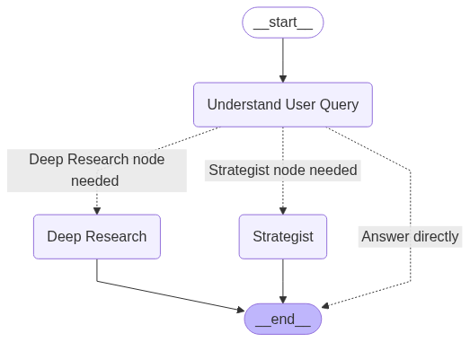

# ⚽ Football Betting Agent


## 📝 Description

This project aims to increase the winning rate in football betting games in the Premier League. We utilize AI agents to analyze team statistics and provide solid suggestions for betting decisions.

## ✨ Features

- **🤖 AI-Powered Analysis**: Leverages advanced AI agents to provide intelligent betting recommendations
- **💬 Interactive Chat Interface**: User-friendly frontend with natural language interaction
- **🔍 Deep Research Capability**: Powered by a research system which can make a comprehensive investigation in specific topic
- **📊 Premier League Data Scraping**: Automatically collects and processes real-time statistics
- **📈 Comprehensive Match Analysis**: Evaluates team performance, historical data, and current form
- **🎯 Personalized Betting Advice**: Tailored recommendations based on user preferences and risk tolerance
- **🔄 Real-time Updates**: Continuous data refresh to ensure the most current information

## 🏗️ Architecture

The system consists of several key components:

1. **Data Collection Layer**: Scrapes and processes Premier League data
2. **AI Analysis Engine**: Processes data and generates insights
3. **User Interface**: Interactive chat-based interface




## 🚀 Getting Started

### 🐳 Run with Docker

1. Make sure you have Docker and Docker Compose installed on your system:
   - [Install Docker](https://docs.docker.com/get-docker/)
   - [Install Docker Compose](https://docs.docker.com/compose/install/)

2. Clone the repository:

   ```bash
   git clone https://github.com/Haemon-Yang/football-betting-agent.git
   cd football-betting-agent
   ```

3. Create a `.env` file with the required API keys:

   ```bash
   # On macOS/Linux
   cp .env_example .env
   
   # On Windows
   copy .env_example .env
   # OR using PowerShell
   Copy-Item .env_example .env
   ```

4. Edit .env and add your API keys
   
   ```bash
   # Edit the .env file and add your API keys:
   OPENAI_API_KEY=your_openai_api_key
   LANGCHAIN_API_KEY=your_langchain_api_key
   TAVILY_API_KEY=your_tavily_api_key
   HUGGINGFACE_API_KEY=your_huggingface_api_key
   ```

5. Build the Docker image:

   ```bash
   docker build --no-cache -t soccer-betting-agent .
   ```

6. Run the Docker image by container

   ```bash
   docker run --name your_container_name -d -p HOST_IP:HOST_PORT:8501 soccer-betting-agent
   ```

   ```bash
   #Example
   docker run --name container_called_aaa -d -p 0.0.0.0:1000:8501 soccer-betting-agent
   ```

   You can set up your HOST_PORT based on your personal preference.
   
   Note: You need to specify the host ip.

7. Access the application in your browser:

   ```
   http://localhost:HOST_PORT
   ```

### 💻 Run Locally

To run the Soccer Betting Agent locally on your machine, follow these steps:

1. **Prerequisites**:
   - Python 3.9+ installed
   - Git installed
   - OpenAI API key and other required API keys

2. **Clone the repository**:

   ```bash
   git clone https://github.com/Haemon-Yang/football-betting-agent.git
   cd football-betting-agent
   ```

3. **Set up a virtual environment** (optional but recommended):

   ```bash
   # On Windows
   python -m venv venv
   venv\Scripts\activate

   # On macOS/Linux
   python3 -m venv venv
   source venv/bin/activate
   ```

4. **Install dependencies**:

   ```bash
   pip install -r requirements.txt
   ```

5. **Configure environment variables**:

   ```bash
   # On macOS/Linux
   cp .env_example .env
   
   # On Windows
   copy .env_example .env
   # OR using PowerShell
   Copy-Item .env_example .env
   
   # Edit the .env file and add your API keys:
   OPENAI_API_KEY=your_openai_api_key
   LANGCHAIN_API_KEY=your_langchain_api_key
   TAVILY_API_KEY=your_tavily_api_key
   HUGGINGFACE_API_KEY=your_huggingface_api_key
   ```

6. **Run the application**:

   ```bash
   streamlit run frontend.py
   ```

7. **Access the application**:

   Open your browser and navigate to:

   ```
   http://localhost:8501
   ```

The application will load the necessary models and start scraping data on first run. You can then interact with the betting agent through the chat interface.

## 🤝 Contributing

Feel free to submit pull request or open an issue for any suggestion or improvements.

## 📄 License

This project is licensed under the MIT license. See the [LICENSE](LICENSE) file for details.

## 📞 Support

For support, please open an issue in the GitHub repository or contact the maintainers.
